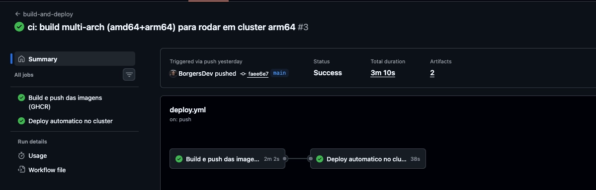
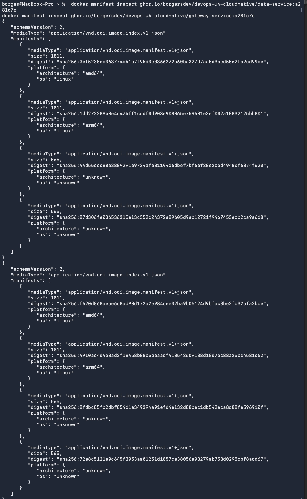

# Evidencias - Passo 1 (CI/CD e GHCR)

Execucao real do pipeline `build-and-deploy` (GitHub Actions, push para `main`).

## Repositorio
- https://github.com/BorgersDev/devops-u4-cloudnative (publico)

## Run final (evidencia principal) - deploy verde de ponta a ponta
- Run: https://github.com/BorgersDev/devops-u4-cloudnative/actions/runs/28300267604
- Commit / tag implantada: `a281c7e`
- Imagens **multi-arch** (amd64 + arm64), para rodar no cluster arm64 (Apple Silicon).

| Job                                  | Status            |
|--------------------------------------|-------------------|
| Build e push das imagens (GHCR)      | completed/success |
| Deploy automatico no cluster         | completed/success |

Detalhes do deploy no cluster (pods, services, rollout status, chamada ao
gateway) em [`deploy-kubernetes.md`](deploy-kubernetes.md).



## Imagens publicadas no GHCR (publicas)

Confirmadas via `docker manifest inspect` (sem autenticacao, pois sao publicas):

```text
OK  ghcr.io/borgersdev/devops-u4-cloudnative/data-service:latest
OK  ghcr.io/borgersdev/devops-u4-cloudnative/data-service:a281c7e
OK  ghcr.io/borgersdev/devops-u4-cloudnative/gateway-service:latest
OK  ghcr.io/borgersdev/devops-u4-cloudnative/gateway-service:a281c7e
```

Cada servico tem duas tags: `latest` e o SHA curto do commit. O deploy usa a tag
por SHA curto para rastreabilidade.



## Historico (runs anteriores)

Contexto de como se chegou ao run final. Nao sao pendencias:

- **Run inicial** ([28299616528](https://github.com/BorgersDev/devops-u4-cloudnative/actions/runs/28299616528),
  commit `5b49761`): validou build + push no GHCR. O job de deploy ficou `queued`
  ate o self-hosted runner (label `k8s`) ser registrado.
- Apos registrar o runner, o deploy revelou que as imagens iniciais eram
  amd64-only (`no matching manifest for linux/arm64`). O workflow passou a buildar
  **multi-arch** (QEMU + `platforms: linux/amd64,linux/arm64`), o que levou ao
  run final verde acima.
