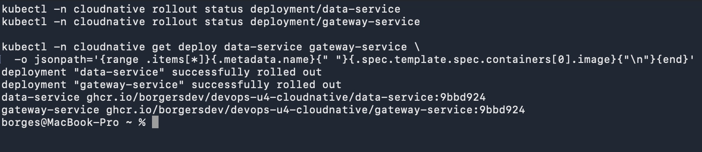
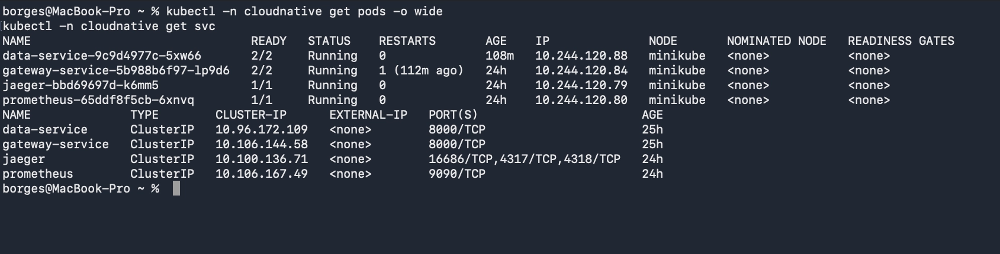
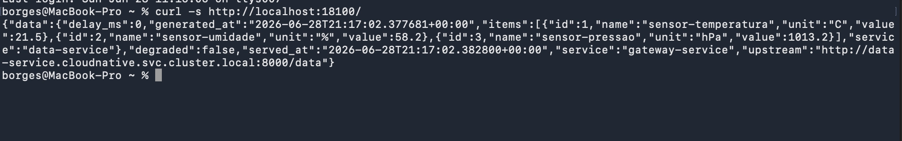

# Evidencias - Passo 1 (deploy no cluster Kubernetes)

Cluster: Minikube com CNI **Calico** (`minikube start --driver=docker --cni=calico`), arm64.
Deploy executado pelo **pipeline** (GitHub Actions) via self-hosted runner (label `k8s`).
Imagens **multi-arch** (amd64+arm64) publicadas no GHCR.

## Run do deploy automatico
- Run: https://github.com/BorgersDev/devops-u4-cloudnative/actions/runs/28300267604
- Commit / tag implantada: `a281c7e`

## kubectl set image + rollout status (executado pelo workflow)
```text
deployment.apps/data-service image updated
deployment.apps/gateway-service image updated
deployment "data-service" successfully rolled out
deployment "gateway-service" successfully rolled out
```



## kubectl get pods -n cloudnative
```text
NAME                              READY   STATUS    RESTARTS   AGE   IP              NODE       NOMINATED NODE   READINESS GATES
data-service-59cf9765f7-6nmxg     1/1     Running   0          68s   10.244.120.77   minikube   <none>           <none>
gateway-service-7fc976747-5f5df   1/1     Running   0          68s   10.244.120.78   minikube   <none>           <none>
```

## kubectl get svc -n cloudnative (ClusterIP)
```text
NAME              TYPE        CLUSTER-IP      EXTERNAL-IP   PORT(S)    AGE
data-service      ClusterIP   10.96.172.109   <none>        8000/TCP   10m
gateway-service   ClusterIP   10.106.144.58   <none>        8000/TCP   10m
```



## Imagem implantada (tag por SHA curto)
```text
data-service: ghcr.io/borgersdev/devops-u4-cloudnative/data-service:a281c7e
gateway-service: ghcr.io/borgersdev/devops-u4-cloudnative/gateway-service:a281c7e
```

## Requisicao ao gateway no cluster (port-forward svc/gateway-service 8100:8000)
Gateway chama o data-service via DNS interno e retorna `degraded:false` com dados reais:
```json
{
  data:
  {
    delay_ms: int,
    generated_at: string,
    items:
    [{
        id: int,
        name: string,
        unit: string,
        value: float
      }] (3)
    service: string
  }
  degraded: bool,
  served_at: string,
  service: string,
  upstream: string[59]
}
```


