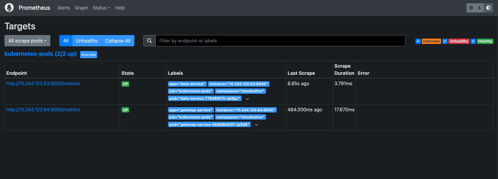
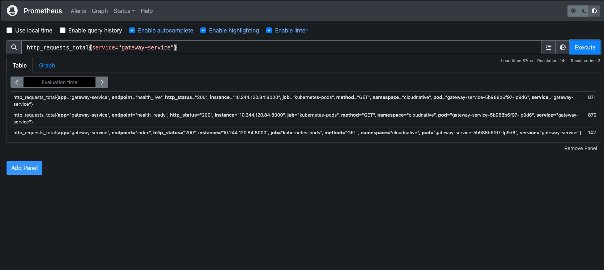
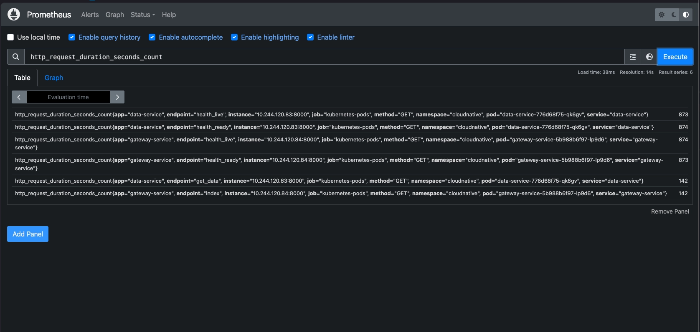
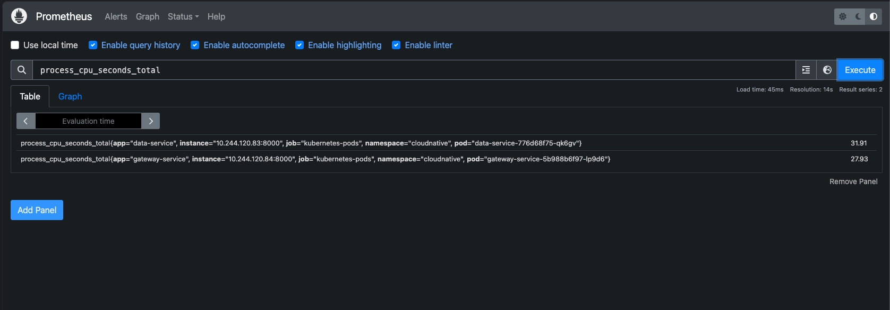

# Evidencias - Passo 2 (observabilidade com Prometheus)

Cluster: Minikube com CNI **Calico**, arm64. Namespace `cloudnative`.
Prometheus instalado por `k8s/observability/prometheus.yaml` (RBAC somente leitura +
`kubernetes_sd_configs` role pod, descoberta por annotations `prometheus.io/*`).
Data: 2026-06-27.

## Como reproduzir

```bash
kubectl apply -f k8s/observability/prometheus.yaml
kubectl -n cloudnative port-forward svc/prometheus 9090:9090
kubectl -n cloudnative port-forward svc/gateway-service 8100:8000
./scripts/generate-traffic.sh http://localhost:8100/ 60
# UI: http://localhost:9090
```

## Log do gerador de trafego (scripts/generate-traffic.sh)

```text
Gerando 60 requisicoes para http://localhost:8100/
Concluido: 60 respostas normais, 0 degradadas, total 60.
Verifique as metricas em Prometheus (/metrics) e os traces na UI do Jaeger.
```

## Targets UP (Prometheus API /api/v1/targets)

Os dois microsservicos foram descobertos por annotations e aparecem `up`:

```text
data-service     pod/data-service-776d68f75-qk6gv       -> up
gateway-service  pod/gateway-service-5b988b6f97-lp9d6   -> up
```

## Consultas PromQL (evidencias obrigatorias)

### 1) Contador de requisicoes: `http_requests_total`

```text
http_requests_total{endpoint="index",service="gateway-service"}  61
```

(o gateway recebeu 60 requisicoes do script + 1 smoke; cada uma gerou tambem uma
chamada interna ao data-service, ver `http_request_duration_seconds_count` abaixo).

### 2) Histograma de latencia: `http_request_duration_seconds`

`http_request_duration_seconds_count` por servico/endpoint:

```text
data-service     get_data       61
gateway-service  index          61
data-service     health_live    13
data-service     health_ready   13
gateway-service  health_live    13
gateway-service  health_ready   13
```

A correspondencia `gateway-service index = 61` e `data-service get_data = 61`
comprova o fluxo fim a fim (cada GET / no gateway chama o data-service).

### 3) CPU do processo: `process_cpu_seconds_total`

Exposto automaticamente pelo `ProcessCollector` padrao do `prometheus_client`:

```text
data-service     1.37
gateway-service  1.11
```

## Amostra do /metrics (gateway-service, formato Prometheus)

```text
# HELP process_cpu_seconds_total Total user and system CPU time spent in seconds.
process_cpu_seconds_total 1.46
# HELP http_requests_total Total de requisicoes HTTP processadas
http_requests_total{endpoint="index",http_status="200",method="GET",service="gateway-service"} 61.0
http_requests_total{endpoint="health_live",http_status="200",method="GET",service="gateway-service"} 22.0
http_request_duration_seconds_count{endpoint="index",method="GET",service="gateway-service"} 61.0
http_request_duration_seconds_sum{endpoint="health_live",method="GET",service="gateway-service"} 0.01925274997483939
# ... buckets le="0.005" ... le="+Inf"
```

## Prints (salvos em `images/`)

1. **Targets UP** (`images/01-prometheus-targets-up.webp`):
   `http://localhost:9090/targets` mostrando `data-service` e `gateway-service`
   como `UP` no job `kubernetes-pods (2/2 up)`.

   

2. **PromQL `http_requests_total`** (`images/02-promql-http-requests-total.webp`):
   consulta `http_requests_total{service="gateway-service"}` com o contador por
   endpoint.

   

3. **PromQL `http_request_duration_seconds`** (`images/03-promql-latencia.webp`):
   consulta `http_request_duration_seconds_count` por servico/endpoint
   (`data-service get_data` casa com `gateway-service index`).

   

4. **PromQL CPU** (`images/04-promql-cpu.webp`): consulta
   `process_cpu_seconds_total` por processo.

   
