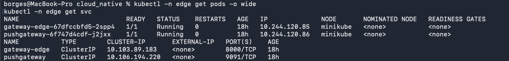
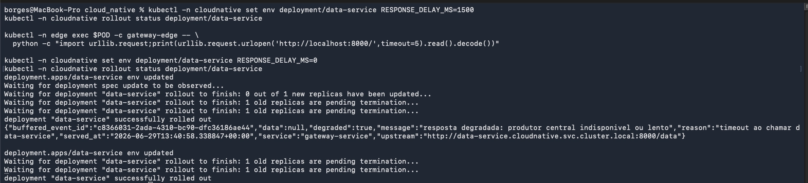
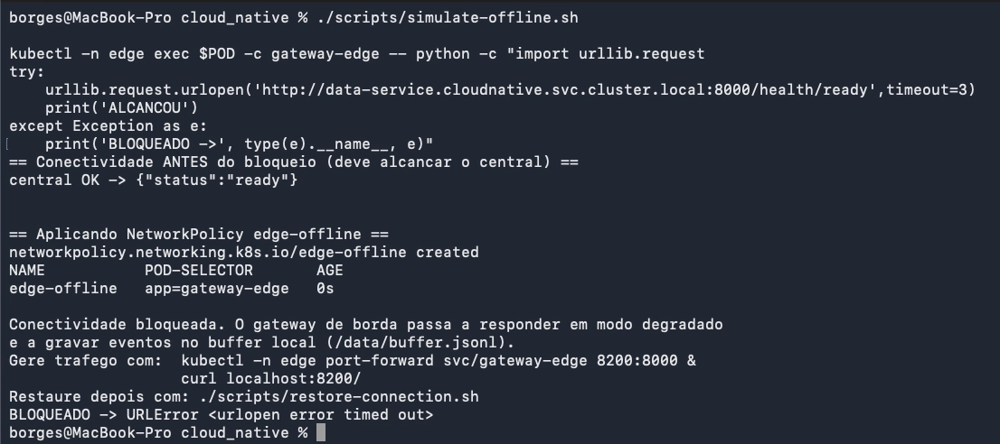
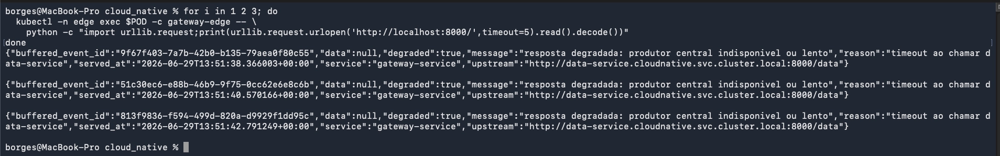
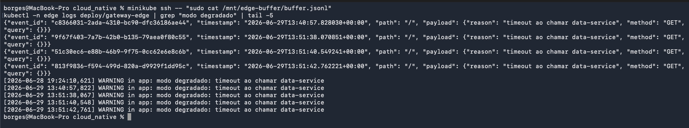
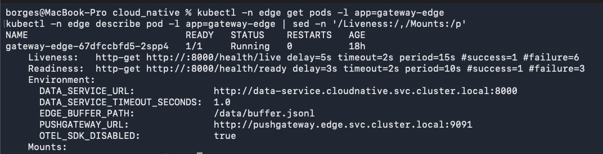
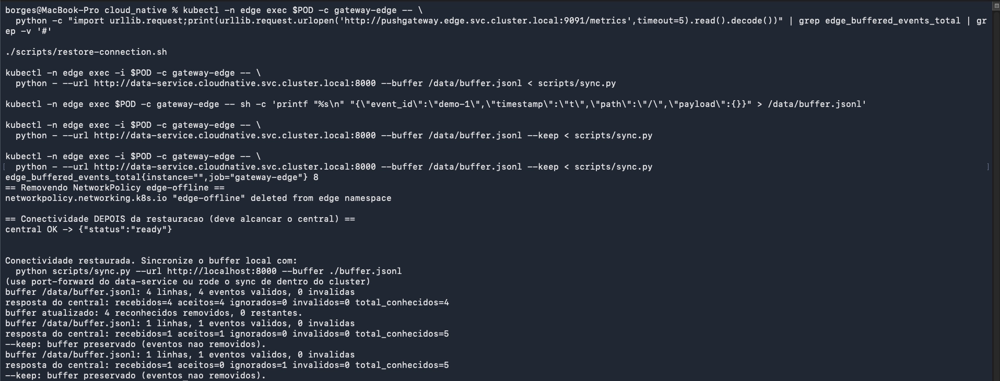

# Evidencias - Passo 3 (validacao no cluster)

Execucao real no **Minikube com CNI Calico** (arm64), namespace `edge`, com a app
central dos Passos 1-2 no ar no namespace `cloudnative`. Data: 2026-06-28.

O gateway de borda usa a **mesma imagem** do gateway central (aqui carregada no
Minikube com a tag local `edge-local`, contendo a logica de buffer). O modo borda e
ligado por env: `EDGE_BUFFER_PATH`, `PUSHGATEWAY_URL`, `OTEL_SDK_DISABLED`.

> Nuance importante: sob `NetworkPolicy` os pacotes ao central sao **descartados**
> (black-hole), entao a chamada estoura o timeout do gateway e o `reason` aparece como
> `timeout ao chamar data-service` (e nao "conexao recusada"). A prova de que e
> bloqueio de REDE (offline) e nao apenas lentidao esta na secao 3: uma chamada direta
> ao `/health/ready` do central a partir do pod de borda tambem da timeout, enquanto
> sem a policy ela responde na hora. Latencia e desconexao sao cenarios distintos
> (delay no produtor vs policy bloqueando), demonstrados separadamente.

## 1. Gateway de borda pronto (US-010)

`kubectl -n edge get pods -o wide`:

```text
NAME                            READY   STATUS    RESTARTS   AGE   IP
gateway-edge-67dfccbfd5-2spp4   1/1     Running   0          ...   10.244.120.85
pushgateway-6f747d4cdf-j2jxx    1/1     Running   0          ...   10.244.120.86
```

Caminho feliz (central acessivel) `GET /` -> `degraded:false` com dados do produtor:

```json
{"data":{"items":[{"id":1,"name":"sensor-temperatura",...}],"service":"data-service"},
 "degraded":false,"service":"gateway-service",
 "upstream":"http://data-service.cloudnative.svc.cluster.local:8000/data"}
```



## 2. Latencia (separada da desconexao, FR-17)

Com `RESPONSE_DELAY_MS=1500` no produtor central (acima do `DATA_SERVICE_TIMEOUT_SECONDS=1.0`
do gateway de borda), `GET /` -> degradado por timeout, central AINDA acessivel:

```json
{"buffered_event_id":"3f195923-890d-4498-9d3d-93aa2e08c91b","degraded":true,
 "reason":"timeout ao chamar data-service","upstream":".../data"}
```



## 3. Offline via NetworkPolicy (US-010, FR-20)

`scripts/simulate-offline.sh` mostra conectividade ANTES (OK) e aplica a policy:

```text
== Conectividade ANTES do bloqueio (deve alcancar o central) ==
central OK -> {"status":"ready"}
== Aplicando NetworkPolicy edge-offline ==
networkpolicy.networking.k8s.io/edge-offline created
NAME           POD-SELECTOR       AGE
edge-offline   app=gateway-edge   0s
```

Prova de que a policy BLOQUEIA o trafego (chamada direta ao central a partir do pod
de borda), distinguindo offline de mera lentidao:

```text
BLOQUEADO -> URLError <urlopen error timed out>
```

`GET /` no edge durante o bloqueio -> degradado + `buffered_event_id`:

```json
{"buffered_event_id":"5ad0d6d8-ce9d-45f1-8150-a50805995e18","degraded":true,
 "reason":"timeout ao chamar data-service","data":null}
```





## 4. Buffer local no hostPath (US-012)

`minikube ssh -- sudo cat /mnt/edge-buffer/buffer.jsonl` (4 eventos: 1 da latencia +
3 do offline), contrato `{event_id, timestamp, path, payload}`:

```json
{"event_id": "3f195923-890d-4498-9d3d-93aa2e08c91b", "timestamp": "2026-06-28T19:23:14.199968+00:00", "path": "/", "payload": {"reason": "timeout ao chamar data-service", "method": "GET", "query": {}}}
{"event_id": "5ad0d6d8-ce9d-45f1-8150-a50805995e18", "timestamp": "2026-06-28T19:24:06.235291+00:00", "path": "/", "payload": {"reason": "timeout ao chamar data-service", "method": "GET", "query": {}}}
{"event_id": "f0ec99bb-13a1-4180-8542-94da9103f60e", "timestamp": "2026-06-28T19:24:08.626024+00:00", "path": "/", "payload": {"reason": "timeout ao chamar data-service", "method": "GET", "query": {}}}
{"event_id": "02bdbf99-d471-4108-9166-715d9580a24a", "timestamp": "2026-06-28T19:24:10.622434+00:00", "path": "/", "payload": {"reason": "timeout ao chamar data-service", "method": "GET", "query": {}}}
```

Log do gateway de borda (`kubectl -n edge logs deploy/gateway-edge`):

```text
WARNING in app: modo degradado: timeout ao chamar data-service
```



## 5. Probes tolerantes durante a instabilidade (US-011)

Mesmo com o central bloqueado, o pod segue `Ready` e com `RESTARTS 0`:

```text
NAME                            READY   STATUS    RESTARTS   AGE
gateway-edge-67dfccbfd5-2spp4   1/1     Running   0          2m59s

Liveness:   http-get http://:8000/health/live  delay=5s timeout=2s period=15s #success=1 #failure=6
Readiness:  http-get http://:8000/health/ready delay=3s timeout=2s period=10s #success=1 #failure=3
Conditions: Ready=True  ContainersReady=True
```



## 6. Observabilidade offline: Pushgateway local (US-013)

Metrica retida no Pushgateway do namespace `edge` (acessivel mesmo offline), igual ao
numero de eventos bufferizados:

```text
edge_buffered_events_total{instance="",job="gateway-edge"} 4
```

## 7. Reconexao e sincronizacao idempotente (US-014)

`scripts/restore-connection.sh` remove a policy e a conectividade volta:

```text
networkpolicy.networking.k8s.io "edge-offline" deleted
central OK -> {"status":"ready"}
```

`scripts/sync.py` (rodado dentro do pod de borda, lendo o buffer do hostPath):

```text
# rodada 1
buffer /data/buffer.jsonl: 4 linhas, 4 eventos validos, 0 invalidas
resposta do central: recebidos=4 aceitos=4 ignorados=0 invalidos=0 total_conhecidos=4
buffer atualizado: 4 reconhecidos removidos, 0 restantes.
# rodada 2 (buffer vazio)
buffer /data/buffer.jsonl: 0 linhas, 0 eventos validos, 0 invalidas
nada a sincronizar.
```

Idempotencia/dedup no central: reinjetando os mesmos 4 `event_id`, o central ignora
todos e `total_conhecidos` nao cresce (sem duplicacao):

```text
resposta do central: recebidos=4 aceitos=0 ignorados=4 invalidos=0 total_conhecidos=4
```


